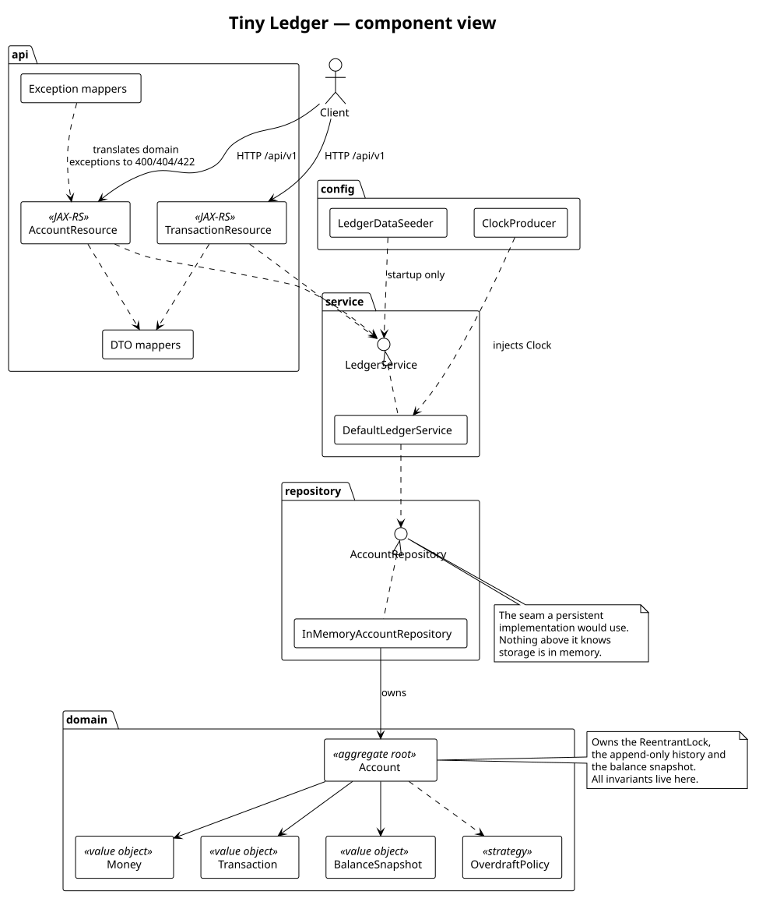
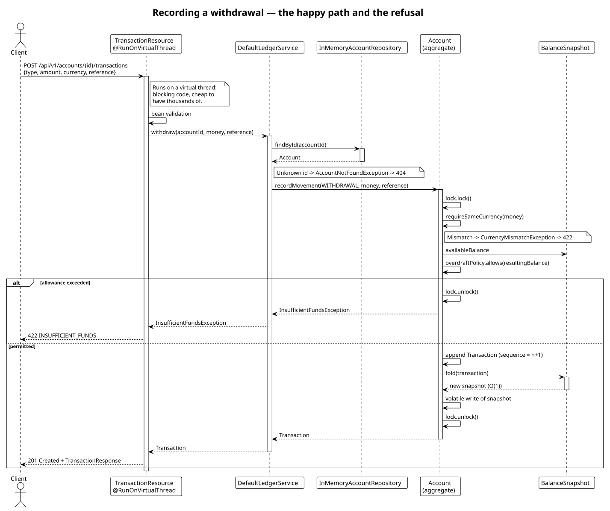
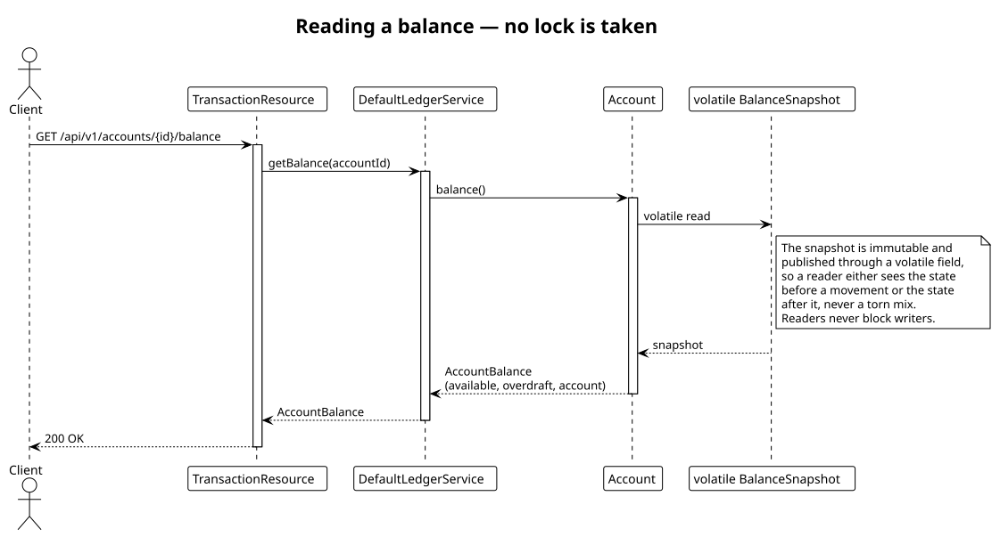

# Architecture

A layered service, small enough to hold in your head, with the interesting decisions pushed
into the domain rather than spread across it.



*(Sources for every diagram are in [`diagrams/`](diagrams); regenerate with
`plantuml -tsvg docs/diagrams/*.puml`.)*

## The layers

| Layer | Package | Responsibility | Knows about |
|---|---|---|---|
| API | `api`, `api/dto`, `api/mapper`, `api/error` | HTTP, JSON, status codes | service, domain |
| Service | `service` | Use cases, orchestration | repository, domain |
| Repository | `repository` | Account lookup and registration | domain |
| Domain | `domain` | The rules of the ledger | nothing |

The dependency arrows all point inwards. `domain` imports nothing from the other three, which
is why the whole rule set is unit-testable without starting a framework — the 100-odd unit
tests need no Quarkus, no HTTP and no mocks beyond a fixed `Clock`.

---

## The domain

### `Money`

An immutable value object of `BigDecimal` + `Currency`. It refuses at construction to hold a
value with more precision than the currency allows (`RoundingMode.UNNECESSARY`, so an
over-precise input throws instead of quietly rounding), and it refuses to add or compare
amounts in different currencies. Arithmetic on money without a currency attached is the
classic way to produce a plausible wrong answer; this type makes that a compile-time or
construction-time problem rather than a production one.

### `Account` — the aggregate root

Everything that must change together lives behind one object: the currency, the overdraft
policy, the append-only `List<Transaction>` and the `BalanceSnapshot`. `Account` owns the lock
that guards them, so there is exactly one place where the ledger's invariants can be broken —
and therefore exactly one place to get right and to review.

The service layer does not compute balances, validate overdrafts or append to the history. It
finds the right `Account` and asks it to record a movement. An anaemic domain model would push
all of that into the service, where the lock and the data it protects would end up in different
classes — which is how concurrency bugs get written.

### `BalanceSnapshot` — the balance model

The naïve implementation of `getBalance` sums the whole history on every read: O(n), and
steadily worse for the accounts that matter most. Instead, each `Account` holds an immutable
snapshot:

```
BalanceSnapshot { availableBalance, lastSequence, lastRecordedAt, transactionCount }
```

Recording a movement folds it into the snapshot in O(1) by applying its signed delta. Reading a
balance is a single volatile field read. `fold()` refuses a transaction whose sequence is not
exactly `lastSequence + 1`, so a replayed or out-of-order fold fails loudly instead of
producing a balance that is merely wrong.

`foldAll()` exists for the audit case: replay a sequence of transactions from a known snapshot
and confirm you arrive at the same number. The concurrency tier uses it to prove the
incremental strategy agrees with a full recomputation after tens of thousands of concurrent
movements.

### The balance model

Two figures, deliberately distinct:

```
availableBalance = sum(transactions)              -- real money moved
accountBalance   = availableBalance + overdraft   -- spending power
```

A withdrawal is permitted when the *resulting* available balance still satisfies the overdraft
policy, i.e. `availableBalance − amount >= −overdraftLimit`.

The overdraft allowance is never a transaction. Writing a €500 allowance into the ledger as a
deposit would make the history claim €500 arrived when nothing did, and would break
`availableBalance == sum(transactions)` — the one invariant the concurrency tests assert
directly. Keeping it as metadata means the history stays an honest record of money movement.

### `OverdraftPolicy` — the open/closed seam

```java
public interface OverdraftPolicy {
    boolean allows(Money resultingAvailableBalance);
}
```

The only implementation today is `FixedOverdraftLimitPolicy`. A tiered limit, a time-of-day
limit or a risk-scored limit is a new implementation, not an edit to `Account`. This is the one
place where extensibility was worth the extra interface: it is the rule most likely to change
per customer, and it is a genuine strategy — one method, no state shared with the aggregate.

---

## Recording a movement



Note where each failure is decided. The unknown account is caught in the service; the currency
mismatch and the overdraft breach are caught inside the aggregate, under the lock. That matters
for the overdraft check: validating outside the lock would be a check-then-act race, and two
concurrent withdrawals could each pass a check that only one of them should.

## Reading a balance



Readers take no lock at all. The snapshot is immutable and published through a `volatile`
field, so a reader sees either the state before a movement or the state after it, never a torn
mixture. See [CONCURRENCY.md](CONCURRENCY.md).

---

## API layer

JAX-RS resources implement the hand-written contract in
[`META-INF/openapi.yaml`](../app/src/main/resources/META-INF/openapi.yaml). Annotation scanning
is disabled, so `/q/openapi` serves exactly the reviewed file; the integration tier then
validates real requests and responses against it, which is what keeps the two from drifting.

DTOs are Java records, separate from the domain types. The mapping is a small, boring cost that
buys the freedom to change `Account` without changing the wire format — and to keep `sequence`
out of the public contract.

Errors are translated by dedicated `ExceptionMapper`s, one per failure class, so no resource
method contains a try/catch. `AccountNotFoundException` → 404, `LedgerException` → 422,
`IllegalArgumentException` → 400, `ConstraintViolationException` → 400 with per-field details,
anything else → 500.

One deliberate oddity: `limit` and `offset` are read as `String` and parsed by hand. JAX-RS
converts them automatically, but a conversion failure produces a **404**, and `limit=abc`
should be a **400**. Reading them as strings is the small price for a contract-accurate status
code.

### Virtual threads

Resource methods are annotated `@RunOnVirtualThread`. The code is plain blocking imperative
Java — no `Uni`, no `Multi`, no callbacks — and scaling comes from the threads being cheap
rather than from the code being non-blocking. Given an in-memory store with no I/O to await, a
reactive model here would add ceremony and subtract readability.

The lock is a `ReentrantLock`, not `synchronized`. On the Java 21 baseline a virtual thread
blocked in a `synchronized` block **pins** its carrier platform thread; blocking on a
`ReentrantLock` unmounts it and frees the carrier for other work. Under a hot-account load test
that difference is the difference between graceful queueing and carrier-thread starvation.

---

## SOLID, concretely

- **Single responsibility** — `Money` does arithmetic, `Account` enforces invariants,
  `DefaultLedgerService` orchestrates use cases, resources translate HTTP. The exception mappers
  exist so that translating a failure into a status code is not smeared across the resources.
- **Open/closed** — `OverdraftPolicy` and `AccountRepository` admit new implementations without
  edits to their callers.
- **Liskov** — `AccountRepository` promises lookup and registration and nothing about storage,
  so a JPA implementation substitutes cleanly; the service layer contains no in-memory
  assumptions.
- **Interface segregation** — two small interfaces rather than one `LedgerFacade`. Neither has a
  method its implementers do not need.
- **Dependency inversion** — the service depends on `AccountRepository`, not on
  `InMemoryAccountRepository`; the `Clock` is injected rather than read from a static. CDI wires
  both, and the unit tests wire them by hand in one line.

## Where the seams are

Three places are designed to be replaced rather than edited:

1. **`AccountRepository`** — swap in persistence. Nothing above it changes, but note that the
   per-account lock currently lives in the aggregate held in memory; a persistent
   implementation would move that guarantee to optimistic locking or a database transaction.
2. **`OverdraftPolicy`** — swap in a different lending rule.
3. **`Clock`** — already swapped, by every test that asserts on a timestamp.
